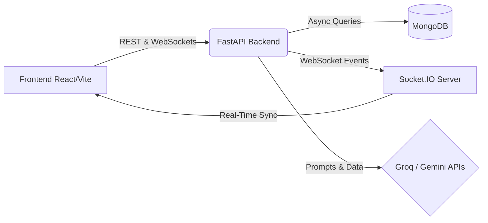

<div align="center">

# 🧠 CortexCraft 

**The Ultimate AI-Powered Developer & Learning Platform**

[](https://reactjs.org/)
[](https://fastapi.tiangolo.com/)
[](https://mongodb.com/)
[](https://socket.io/)
[](https://groq.com/)

*Transform Notes → Superpowers: Summary, Mindmaps, Quizzes, Interviews, Resume Analysis, and Real-Time Communities*

</div>

---

## 🌟 Overview

CortexCraft is an intelligent, comprehensive platform designed to supercharge your study and development workflow with cutting-edge AI. Whether you're a student trying to comprehend complex topics, or a developer aiming to crush your next technical interview and collaborate in real-time, CortexCraft provides the premium tools you need. 

Built with an ultra-modern tech stack, the platform offers everything from instant note summaries and 3D visual mindmaps to adaptive quizzes, a real-time developer community, and ATS-optimized resume analysis.

---

## ✨ Key Features

### 🚀 Developer & Career Tools
- **📄 AI Resume Analyzer:** Upload your resume to get deep, ATS-optimized suggestions powered by **Groq (Llama 3.3)**. Ensure your resume passes the screen and lands you the interview.
- **💬 Mock Interviews:** Practice technical and behavioral interviews with our AI interviewer.
- **💻 Real-Time Developer Community:** A Discord-style, real-time collaboration environment built with **Socket.IO**. Chat, share ideas, and build together seamlessly.

### 🧠 AI Learning Suite
- **📝 Smart Summary:** Instantly extract key points and generate a TL;DR from your lengthy notes.
- **🗺️ Visual Mindmaps:** Auto-generate interactive knowledge graphs to visualize complex topics.
- **✅ Adaptive Quizzes:** Test your knowledge with dynamically generated quizzes that adapt to your skill level.
- **📚 Flashcards:** AI-generated, Anki-style cards for spaced repetition.
- **🤖 Chat Companion:** Context-aware study assistant available 24/7 to answer your doubts.
- **📊 Analytics:** Track your learning progress and performance over time with beautiful **Recharts** dashboards.

---

## 🛠 Tech Stack

Our platform leverages the latest and greatest technologies for a premium, performant user experience.

### Frontend
- **Framework:** React 19, TypeScript, Vite
- **UI/UX:** Framer Motion (animations), Lucide React (icons)
- **3D & Visuals:** React Three Fiber, Drei
- **Routing & State:** React Router v7, Socket.IO Client

### Backend
- **Framework:** FastAPI (Python)
- **Real-Time:** Socket.IO ASGI App
- **Database:** MongoDB (Motor / Async API)
- **AI/LLM Integrations:** Groq (Llama 3.3) and Google Gemini APIs

---

## 🏗️ Architecture



---

## 🚀 Quick Start

### Prerequisites
Make sure you have the following installed:
- **Node.js** (v18 or higher)
- **Python** (v3.10 or higher)
- **MongoDB** (Running locally or via Atlas)

### 1. Clone the Repository

```bash
git clone <repository-url>
cd CortexCraft
```

### 2. Backend Setup

```bash
cd backend/app

# Create and activate virtual environment
python -m venv venv
source venv/bin/activate  # On Windows: venv\Scripts\activate

# Install dependencies
pip install -r ../requirements.txt

# Create .env file based on configurations
# Add your GROQ_API_KEY, GEMINI_API_KEY, and MONGO_URI
```

**Run the Backend:**
*Note: We run the combined ASGI app to support both REST and WebSockets!*
```bash
uvicorn main:combined_app --reload
```

### 3. Frontend Setup

```bash
cd frontend

# Install dependencies
npm install

# Start the development server
npm run dev
```

The frontend will be available at `http://localhost:5173` and the backend API at `http://localhost:8000`.

---

## 📁 Project Structure

```text
CortexCraft/
├── frontend/               # React 19 + TypeScript + Vite
│   ├── src/
│   │   ├── components/     # Reusable UI components
│   │   ├── pages/          # Page views (Dashboard, Resume, Community...)
│   │   └── ...
├── backend/                # FastAPI application
│   ├── app/
│   │   ├── routes/         # REST API endpoints (summary, resume, community...)
│   │   ├── socket_coding.py# Socket.IO event handlers
│   │   ├── models/         # MongoDB schemas
│   │   ├── main.py         # App entry point
│   │   └── ...
```

---

## 🔮 Roadmap

- [x] Complete AI Learning Suite (Summaries, Quizzes, Flashcards)
- [x] Integrate Groq (Llama 3.3) for rapid inference
- [x] Launch Resume Analyzer & Mock Interviews
- [x] Deploy Real-Time Developer Community with WebSockets
- [ ] Enhance 3D visualizations for Mindmaps using React Three Fiber
- [ ] Launch full-featured Mobile Application

---

## 🤝 Contributing

We welcome contributions from the community! 
1. Fork the repository.
2. Create a new branch: `git checkout -b feature/your-feature-name`.
3. Commit your changes.
4. Push to the branch and open a Pull Request.

---

## 📄 License

This project is licensed under the MIT License.

---

<div align="center">
Built with ❤️ for learners and developers.
<br/>
⭐ <strong>Star us on GitHub if you like this project!</strong> ⭐
</div>
